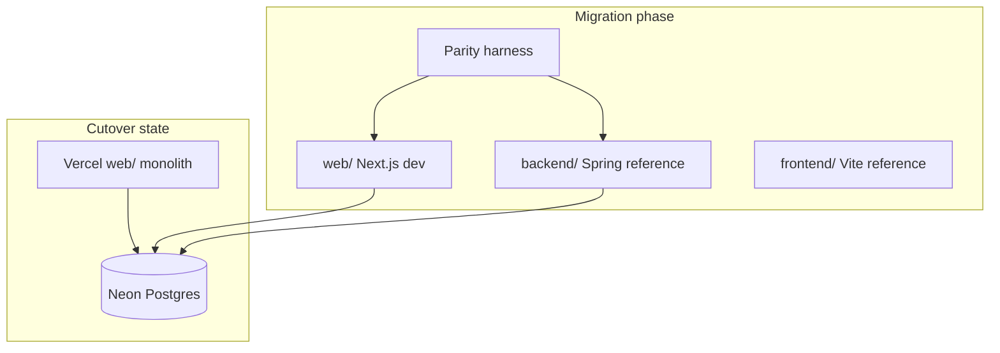

# Next.js Monolith Migration - Plan

## Goal Capsule

**Objective:** Replace the split Vite SPA (`frontend/`) + Spring Boot API (`backend/`) with one Next.js App Router monolith (`web/`) on a new Vercel project, preserving exact OnRoad behavior (catalog, on-road calculation, Excel export, admin CRUD, quote history, i18n, PDF export).

**Authority:** This plan's Product Contract and Planning Contract. The Java service tests in `backend/src/test/` are the behavioral spec for fee math and policies until cutover.

**Stop conditions:** Cutover happens only when parity harness passes for every public and admin API route, Excel export matches the Spring template output for a reference quote set, and manual quote-flow smoke passes on the new domain.

**Execution profile:** API-first strangler — build and prove `/api` on the new Vercel project before migrating UI pages. Keep `frontend/` and `backend/` as reference until cutover.

**Tail ownership:** After cutover, retire Render backend and old Vercel frontend project; update root `AGENTS.md` and child DOX to point at `web/`.

---

## Product Contract

### Summary

OnRoad moves to a single Vercel deployment where App Router pages and `/api` route handlers share one origin. Operators and sales staff keep today's flows: brand portal → vehicle → on-road quote → Excel/PDF export, admin data editing, and quote history search. Neon PostgreSQL remains the only database for all environments.

### Problem Frame

Production runs as two deployments: React+Vite on Vercel and Spring Boot on Render. The team wants one Vercel deployment and one codebase to operate. A prior verdict rejected backend-only Next.js (poor fit for Excel + Postgres without monolith benefits). The active direction is a full monolith with exact parity before cutover.

### Requirements

- R1. The monolith serves all current public API routes under `/api/*` with response shapes compatible with `frontend/src/api/client.ts`.
- R2. On-road cost calculation matches Spring `OnRoadCostService` for the same inputs (vehicle, location, usage, offers, extras).
- R3. Excel export fills `backend/src/main/resources/templates/bang-bao-gia.xlsx` with the same cell mapping and label translation (`vi` / `en` / `zh` / `ja`) as `QuoteExportService` / `QuoteLabels`.
- R4. Admin operator login returns a bearer token; all `/api/admin/**` routes reject unauthenticated requests.
- R5. Admin CRUD covers catalog entities (brands, categories, locations, dealers, vehicles, fee definitions, fee rules) plus policy editors (fee policy, dealer policy, plate regions) persisted in `app_settings` with YAML defaults.
- R6. Quote history supports list (`?q=`), get by id, and POST save (PDF flow from client).
- R7. Vietnamese → en/zh/ja translation for admin fields uses glossary-first then MyMemory, matching `TextTranslateService`.
- R8. UI routes match today: `/`, `/admin`, `/quotes`, `/brand/:brandCode`, `/brand/:brandCode/vehicles/:vehicleId`, `/brand/:brandCode/vehicles/:vehicleId/on-road`.
- R9. Default UI language is Vietnamese; quote sheet, Excel, and PDF follow the active language (`frontend/src/i18n/` behavior).
- R10. Quote page layout stays two equal columns — Price left, Accessories right.
- R11. Local and production development use Neon Postgres only (no H2).
- R12. Production launches on a new domain/Vercel project; cutover retires Render and the old frontend deployment.

### Actors

- A1. **Sales operator** — builds quotes, exports Excel/PDF, searches quote history. Must sign in.
- A2. **Catalog operator** — edits vehicles, fees, dealer policies, plate regions via `/admin`.

### Key Flows

- F1. **Quote flow** — brand → search vehicle → confirm details/usage → on-road page → calculate → edit extras → recalculate → export Excel (saves history) or PDF (client capture + POST quote).
- F2. **Admin flow** — sign in → edit catalog or policy tables → optional translate-from-Vietnamese for empty en/zh/ja fields.

### Acceptance Examples

- AE1. Given a Mitsubishi vehicle and Hà Nội location, `POST /api/calculate-on-road-cost` returns the same fee line totals as the Spring API for PRIVATE usage with default extras.
- AE2. Given the same quote inputs in `vi`, `POST /api/export-quote` returns an `.xlsx` file that opens with correct Vietnamese labels and amounts beside template labels.
- AE3. Given valid admin credentials, `POST /api/auth/login` returns a token that authorizes `GET /api/admin/catalog`.
- AE4. On the on-road page, Price and Accessories panels render side by side; Excel download succeeds when customer name is omitted (fallback `Khách hàng`).

### Success Criteria

- All R1–R12 satisfied on the new domain before Render decommission.
- Ported Vitest suites pass for fee math, policies, auth, quote history, and catalog admin logic.
- Manual smoke: brand → vehicle → calculate → export xlsx and pdf on new deployment.

### Scope Boundaries

**In scope:** Full API port, UI port, Neon-only dev, new Vercel project, parity validation, DOX updates at cutover.

**Deferred for later:** Swagger/OpenAPI on Next.js, rate limiting, observability beyond Vercel defaults.

**Outside this product's identity:** Changing fee formulas, redesigning quote UX, multi-brand beyond current catalog model.

### Deferred to Follow-Up Work

- Remove `backend/` and `frontend/` directories after a stable cutover window.
- Custom domain DNS cutover documentation for operators.

### Key Decisions

- KD1. **Full monolith over backend-only Next.js** (session-settled: user-approved — chosen over API-only replacement: ce-pov rejected poor Excel/Postgres fit without UI merge).
- KD2. **Single Vercel deployment** (session-settled: user-directed — chosen over split Vercel + Render: primary migration driver).
- KD3. **Exact parity before cutover** (session-settled: user-directed — chosen over core-quote-first phased release).
- KD4. **Neon only for local dev** (session-settled: user-directed — chosen over H2 offline dev).
- KD5. **New production domain** (session-settled: user-approved — chosen over keeping `project-sales.vercel.app`).
- KD6. **API-first strangler cutover** (session-settled: user-approved — chosen over big-bang or UI-first: recommended safest path for exact parity).

Governs R1, R2, R12.

### Dependencies / Assumptions

- Neon schema from `db/neon-init.sql` is unchanged; no Hibernate `ddl-auto` on production.
- YAML policy defaults (`fee-policy.yml`, `dealer-policy.yml`, `license-plate-regions.yml`) remain source files; `app_settings` overrides persist across restarts.
- Vercel Pro (or equivalent) supports Node.js runtime and adequate function duration for Excel generation.
- Operators accept re-login after cutover if token signing implementation changes.

### Outstanding Questions

- OQ1 (deferred): Final production domain name — assign during Vercel project setup.
- OQ2 (deferred): Whether to keep Spring parity harness running post-cutover or archive after one release.

---

## Planning Contract

### Key Technical Decisions

- KTD1. **New `web/` app, parallel to `frontend/` and `backend/`** — Enables API-first development and side-by-side parity testing without breaking live deployments.
- KTD2. **Drizzle ORM + `@neondatabase/serverless`** — Matches Neon serverless/Vercel deployment; schema mirrors `db/neon-init.sql` tables. No JPA/H2.
- KTD3. **ExcelJS for template fill** — Ports Apache POI behavior in `QuoteExportService`; copy `bang-bao-gia.xlsx` into `web/` assets.
- KTD4. **HMAC bearer admin auth** — Reimplement `AdminAuthService` token semantics (`ADMIN_USERNAME`, `ADMIN_PASSWORD`, `ADMIN_TOKEN_SECRET` env vars).
- KTD5. **Vitest domain tests ported from Java** — `FeeRuleResolverTest`, `FeeAmountCalculatorTest`, `FeePolicyTest`, `DealerPolicyTest`, `AdminAuthServiceTest`, `QuoteHistoryServiceTest`, `CatalogAdminServiceTest`, `TextTranslateServiceTest` are the acceptance spec.
- KTD6. **Optional HTTP parity harness** — Script or Vitest integration suite comparing Spring (`localhost:8003`) vs Next (`localhost:3000`) responses during migration; not required in production after cutover.

### High-Level Technical Design

**API route map** (App Router `app/api/**/route.ts`):

| Area | Routes | Spring reference |
|------|--------|------------------|
| Public | `/api/health`, `/api/brands`, `/api/vehicles/*`, `/api/calculate-on-road-cost`, `/api/export-quote`, `/api/quotes/*`, `/api/dealer-policy`, `/api/vehicle-categories`, `/api/locations` | `ReferenceDataController`, `VehicleController`, `CalculationController`, `QuoteHistoryController` |
| Auth | `/api/auth/login` | `AuthController` |
| Admin | `/api/admin/**` | `AdminCatalogController` |

**Layering inside `web/`:**

- `src/server/db/` — Drizzle schema, Neon client
- `src/server/domain/` — fee math, policies (ported from `backend/.../service/`)
- `src/server/services/` — catalog, export, history, translate, admin
- `src/app/api/` — route handlers (thin)
- `src/app/` — UI pages (ported from `frontend/src/pages/`)
- `src/components/`, `src/i18n/`, `src/lib/` — ported from frontend

### Assumptions

- Next.js 15 App Router with `runtime = 'nodejs'` on Excel and DB routes.
- `DATABASE_URL` uses Neon pooled or serverless driver URL in Vercel env.
- Static assets (`public/accessories/`, `public/colors/`, `public/brand/`) copy from `frontend/public/`.

### Sequencing

Phase A (API): U1 → U2 → U3 → U5 → U6 → U7 → U4 (harness can start after U5).
Phase B (UI): U8.
Phase C (Ops): U9.

### Alternative Approaches Considered

- **In-place `frontend/` → Next.js conversion** — Rejected: harder to run Spring parity in parallel.
- **Keep Spring, add Next.js BFF proxy only** — Rejected: does not achieve single deploy goal.
- **Prisma instead of Drizzle** — Viable; Drizzle chosen for lighter serverless bundle and explicit SQL alignment with `neon-init.sql`.

### Risks & Dependencies

| Risk | Mitigation |
|------|------------|
| Excel template cell mapping drift | Golden-file test: export one reference quote, compare key cells |
| Vercel function timeout on export | `nodejs` runtime; keep workbook in memory only for template size; monitor duration |
| Fee math regression | Port all 8 Java service tests to Vitest before wiring routes |
| Connection pool exhaustion | Use `@neondatabase/serverless` HTTP/WebSocket driver per Vercel guidance |
| i18n SSR/hydration issues | Keep client-side language switcher pattern from `frontend/src/i18n/` initially |

### Operational / Rollout Notes

- New Vercel project root directory: `web/`.
- Env vars: `DATABASE_URL`, `ADMIN_USERNAME`, `ADMIN_PASSWORD`, `ADMIN_TOKEN_SECRET` (mirror `backend/.env.example`).
- Cutover checklist: parity green → DNS/domain → smoke on production → disable Render → archive old Vercel frontend.

---

## Implementation Units

### U1. Next.js monolith scaffold

**Goal:** Create `web/` with Next.js 15 App Router, TypeScript, Tailwind, Lucide, and Vercel-ready config.

**Requirements:** R8, R11, R12

**Dependencies:** None

**Files:**
- `web/package.json`
- `web/next.config.ts`
- `web/tsconfig.json`
- `web/tailwind.config.ts`
- `web/postcss.config.js`
- `web/.env.example`
- `web/vercel.json` (if needed beyond defaults)
- `web/src/app/layout.tsx`
- `web/src/app/page.tsx` (placeholder)

**Approach:**
1. `create-next-app` pattern with App Router, TS, Tailwind, no src dir conflicts — use `src/` to mirror frontend layout.
2. Copy Tailwind theme conventions from `frontend/`.
3. Document env vars matching `backend/.env.example` (Neon + admin).

**Patterns to follow:** `frontend/package.json`, `frontend/vite.config.ts` (port aliases only).

**Test scenarios:**
- `npm run build` in `web/` completes without error.

**Verification:** `cd web && npm run build` succeeds.

---

### U2. Database layer and policy config

**Goal:** Connect to Neon via Drizzle; load YAML policy defaults with `app_settings` override pattern.

**Requirements:** R5, R11

**Dependencies:** U1

**Files:**
- `web/src/server/db/schema.ts`
- `web/src/server/db/client.ts`
- `web/src/server/db/repositories/*.ts`
- `web/src/server/config/fee-policy.ts`
- `web/src/server/config/dealer-policy.ts`
- `web/src/server/config/plate-regions.ts`
- `web/src/server/config/app-settings.ts`
- `web/drizzle.config.ts`
- `web/src/server/db/schema.test.ts`

**Approach:**
1. Define Drizzle tables matching `db/neon-init.sql` (brands, vehicles, locations, fee_rules, app_settings, quote_history, etc.).
2. Port policy loading from `FeePolicyProperties`, `DealerPolicyProperties`, plate YAML — read defaults from copied YAML files in `web/src/server/config/data/`.
3. `app_settings` JSON overrides take precedence over YAML, matching `PolicyAdminService` behavior.

**Patterns to follow:** `db/neon-init.sql`, `backend/src/main/resources/fee-policy.yml`, `PolicyAdminService.java`.

**Execution note:** Schema is SQL-first — do not auto-migrate production; `drizzle-kit` for dev introspection only.

**Test scenarios:**
- Given `app_settings` row for fee policy, loader returns DB value not YAML default.
- Given no override, registration tax percent matches `fee-policy.yml`.
- Repository fetch returns active vehicle by id.

**Verification:** Vitest passes for policy loader and one repository round-trip against Neon dev branch.

---

### U3. Domain services and unit tests (fee math)

**Goal:** Port calculation core with Vitest suites matching Java tests.

**Requirements:** R2

**Dependencies:** U2

**Files:**
- `web/src/server/domain/fee-rule-resolver.ts`
- `web/src/server/domain/fee-amount-calculator.ts`
- `web/src/server/domain/fee-policy.ts`
- `web/src/server/domain/dealer-policy.ts`
- `web/src/server/domain/on-road-cost.ts`
- `web/src/server/domain/*.test.ts` (8 test files mirroring Java)

**Approach:**
1. Read each Java test file and port cases verbatim (inputs/expected outputs).
2. Implement domain modules without HTTP or DB in unit tests — inject fixtures.
3. `on-road-cost.ts` orchestrates resolver, calculator, dealer pricing like `OnRoadCostService`.

**Patterns to follow:** `backend/src/test/java/com/vehisales/platform/service/*Test.java`, `OnRoadCostService.java`, `service/AGENTS.md`.

**Execution note:** Port `FeeRuleResolverTest` and `FeeAmountCalculatorTest` before `on-road-cost.ts` integration.

**Test scenarios:**
- Covers AE1. PRIVATE usage Hanoi quote matches Java fixture totals.
- Registration tax percent applied to Giá Bán per R2.
- LICENSE_PLATE fixed amount from plate regions YAML for location code.
- Company offer FORGO_FOR_CREDIT reduces list price.
- Commercial usage applies commercial registration tax percent.

**Verification:** `cd web && npm test` — all domain tests green.

---

### U4. Parity harness (API contract)

**Goal:** Automated comparison of Next vs Spring API responses during migration.

**Requirements:** R1, R2, R12

**Dependencies:** U5 (minimum public calculate route)

**Files:**
- `web/scripts/parity-harness.ts` or `web/src/server/parity/harness.test.ts`
- `web/src/server/parity/fixtures.json`

**Approach:**
1. Configurable `SPRING_BASE` (default `http://localhost:8003`) and `NEXT_BASE` (`http://localhost:3000`).
2. For each fixture: same request to both; deep-compare JSON (normalize dates/ordering).
3. Include calculate, brands list, vehicle detail, dealer-policy, export-quote (binary hash compare for xlsx).

**Test scenarios:**
- Harness reports diff when Spring and Next totals diverge.
- Harness passes when both return identical calculate breakdown for fixture set.

**Verification:** Harness runs in CI or locally with both servers up; documented in Verification Contract.

---

### U5. Public API routes and auth

**Goal:** Implement all non-admin `/api` routes and `POST /api/auth/login`.

**Requirements:** R1, R4, R6

**Dependencies:** U3

**Files:**
- `web/src/app/api/health/route.ts`
- `web/src/app/api/brands/route.ts`
- `web/src/app/api/brands/[code]/route.ts`
- `web/src/app/api/vehicles/search/route.ts`
- `web/src/app/api/vehicles/route.ts`
- `web/src/app/api/vehicles/[id]/route.ts`
- `web/src/app/api/vehicle-categories/route.ts`
- `web/src/app/api/locations/route.ts`
- `web/src/app/api/dealer-policy/route.ts`
- `web/src/app/api/calculate-on-road-cost/route.ts`
- `web/src/app/api/auth/login/route.ts`
- `web/src/server/services/catalog.ts`
- `web/src/server/services/admin-auth.ts`
- `web/src/server/middleware/admin-auth.ts`
- `web/src/app/api/**/route.test.ts`

**Approach:**
1. Thin route handlers delegate to services.
2. DTO shapes match `frontend/src/types` and Spring JSON field names (camelCase).
3. Admin auth service ports HMAC token issue/validate from `AdminAuthService.java`.

**Patterns to follow:** `frontend/src/api/client.ts`, `ReferenceDataController.java`, `VehicleController.java`, `CalculationController.java`, `AuthController.java`.

**Test scenarios:**
- `GET /api/health` returns database status and brand count.
- `POST /api/auth/login` with bad password returns 401.
- `POST /api/calculate-on-road-cost` with unknown vehicle returns 404.
- Covers AE1.

**Verification:** Route integration tests pass; manual `curl` against local Next matches Spring for health + brands.

---

### U6. Excel export and quote history

**Goal:** Port `POST /api/export-quote` and `/api/quotes` CRUD.

**Requirements:** R3, R6

**Dependencies:** U5

**Files:**
- `web/src/server/services/quote-export.ts`
- `web/src/server/services/quote-labels.ts`
- `web/src/server/services/quote-history.ts`
- `web/src/app/api/export-quote/route.ts`
- `web/src/app/api/quotes/route.ts`
- `web/src/app/api/quotes/[id]/route.ts`
- `web/src/server/assets/bang-bao-gia.xlsx`
- `web/src/server/services/quote-export.test.ts`

**Approach:**
1. Copy template from `backend/src/main/resources/templates/bang-bao-gia.xlsx`.
2. ExcelJS loads template, fills cells per `QuoteExportService` / `QuoteLabels` logic.
3. Export route sets `Content-Disposition` attachment; uses `nodejs` runtime.
4. `export-quote` persists to `quote_history` like Spring.

**Patterns to follow:** `QuoteExportService.java`, `QuoteLabels.java`, `QuoteHistoryService.java`, `QuoteHistoryController.java`.

**Execution note:** Golden test — export reference quote in `vi` and assert known cell values.

**Test scenarios:**
- Covers AE2. Export returns `application/vnd.openxmlformats-officedocument.spreadsheetml.sheet`.
- Export with blank customer name rejected or handled per Spring `@NotBlank` (frontend sends fallback).
- `GET /api/quotes?q=Nguyen` finds accent-folded matches.
- `POST /api/quotes` saves PDF payload from client.

**Verification:** Vitest golden export test passes; manual open xlsx in Excel/LibreOffice.

---

### U7. Admin API routes

**Goal:** Full `/api/admin/**` surface including catalog CRUD, policy editors, translate.

**Requirements:** R4, R5, R7

**Dependencies:** U5, U6

**Files:**
- `web/src/app/api/admin/**/route.ts` (mirror `AdminCatalogController` paths)
- `web/src/server/services/catalog-admin.ts`
- `web/src/server/services/policy-admin.ts`
- `web/src/server/services/text-translate.ts`
- `web/src/server/services/catalog-admin.test.ts`
- `web/src/server/services/text-translate.test.ts`

**Approach:**
1. Middleware validates `Authorization: Bearer` on all `/api/admin/*` routes.
2. Port CRUD operations from `CatalogAdminService` and `PolicyAdminService`.
3. Translate: glossary map first, then MyMemory API fallback.

**Patterns to follow:** `AdminCatalogController.java`, `CatalogAdminService.java`, `TextTranslateService.java`.

**Test scenarios:**
- Covers AE3. Valid token allows `GET /api/admin/catalog`.
- Missing token returns 401 on admin routes.
- `PUT /api/admin/fee-policy` persists to `app_settings`.
- Translate returns en/zh/ja for Vietnamese input.

**Verification:** Ported `CatalogAdminServiceTest` and `TextTranslateServiceTest` pass.

---

### U8. UI migration (App Router pages)

**Goal:** Port all React pages and shared components from Vite to Next.js.

**Requirements:** R8, R9, R10

**Dependencies:** U5, U6, U7

**Files:**
- `web/src/app/page.tsx` (BrandPortal)
- `web/src/app/admin/page.tsx`
- `web/src/app/quotes/page.tsx`
- `web/src/app/brand/[brandCode]/page.tsx`
- `web/src/app/brand/[brandCode]/vehicles/[vehicleId]/page.tsx`
- `web/src/app/brand/[brandCode]/vehicles/[vehicleId]/on-road/page.tsx`
- `web/src/components/**` (from `frontend/src/components/`)
- `web/src/i18n/**`
- `web/src/lib/**` (adminAuth, quoteExtras, softSearch, exportQuotePdf)
- `web/src/auth/AdminAuthContext.tsx`
- `web/public/**` (accessories, colors, brand assets)

**Approach:**
1. Move components with minimal changes; replace `react-router` `Link`/`useParams` with `next/link` and `useParams` from `next/navigation`.
2. Remove `VITE_API_BASE` — use same-origin `/api` fetches.
3. Mark interactive pages `'use client'` where needed; keep PDF export client-only (`html2canvas` + `jspdf`).
4. Login gate wraps layout like `frontend/src/App.tsx`.

**Patterns to follow:** `frontend/src/pages/`, `frontend/AGENTS.md`, `frontend/src/pages/AGENTS.md`.

**Test scenarios:**
- Covers AE4. On-road page renders two-column layout.
- Language switch updates `document.documentElement.lang`.
- Excel export triggers download blob from `/api/export-quote`.
- PDF export captures `#quote-sheet` and POSTs to `/api/quotes`.

**Verification:** `cd web && npm run build`; manual smoke on `localhost:3000`.

---

### U9. Deploy, cutover, and DOX update

**Goal:** Production on new Vercel project; retire split stack; update docs.

**Requirements:** R12

**Dependencies:** U4, U8

**Files:**
- `web/README.md`
- `AGENTS.md` (root)
- `web/AGENTS.md`
- Remove or archive notes in `backend/AGENTS.md`, `frontend/AGENTS.md` (mark deprecated)

**Approach:**
1. Create Vercel project pointing at `web/`.
2. Set production env vars (Neon, admin secrets).
3. Run parity harness against staging Spring + staging Next.
4. Switch domain; run manual smoke.
5. Disable Render service; remove `VITE_API_BASE` dependency from old frontend.
6. Update root AGENTS.md Child DOX Index to `web/`.

**Test scenarios:**
- Production `GET /api/health` returns ok.
- Live quote flow completes on new domain.

**Verification:** Definition of Done checklist complete.

---

## Verification Contract

| Gate | Command / action |
|------|------------------|
| Domain unit tests | `cd web && npm test` |
| Production build | `cd web && npm run build` |
| Parity (migration) | Run parity harness with Spring on `:8003` and Next on `:3000` |
| Legacy backend (reference) | `cd backend && mvn test` (unchanged during migration) |
| Manual smoke | Brand → vehicle → calculate → edit extras → export xlsx + pdf |
| Pre-cutover | Parity harness green for full fixture set |

---

## Definition of Done

**Global:**
- [ ] All R1–R12 verified on new Vercel deployment
- [ ] Vitest domain and service tests pass
- [ ] `web/` builds cleanly
- [ ] Parity harness passes against Spring reference
- [ ] Root `AGENTS.md` updated for `web/` monolith
- [ ] Render backend decommissioned
- [ ] No abandoned scaffold or dead code from migration experiments in `web/`

**Per unit:** Each U1–U9 verification section satisfied before marking unit complete.

---

## Appendix

### Product Contract preservation

Product Contract authored from ce-plan-bootstrap using session brainstorm + ce-pov verdict (2026-08-20). No scope change from confirmed plan scoping synthesis.

### API inventory (Spring → Next)

Public: 6 controller groups, ~15 endpoints. Admin: ~35 endpoints under `/api/admin/**` (see `AdminCatalogController.java` grep output).

### Sources

- `backend/AGENTS.md` — API surface, env, calculation rules
- `frontend/AGENTS.md` — routes, i18n, quote layout
- `backend/src/test/java/com/vehisales/platform/service/` — behavioral spec
- `frontend/src/api/client.ts` — client contract
- Session ce-pov verdict — reject backend-only Next.js
