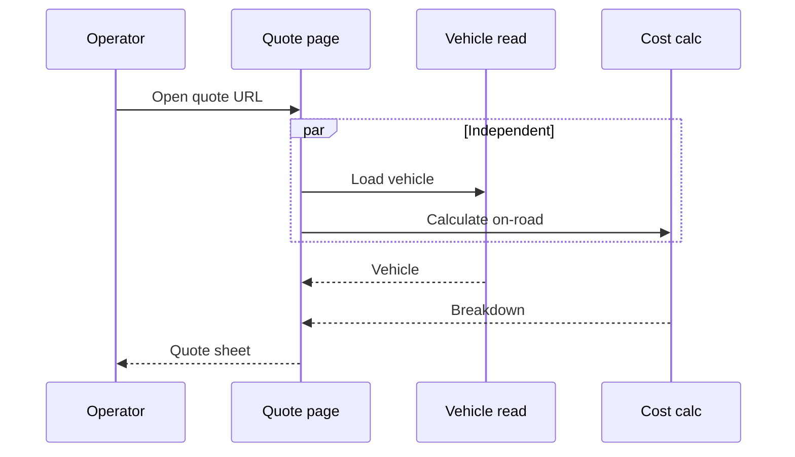
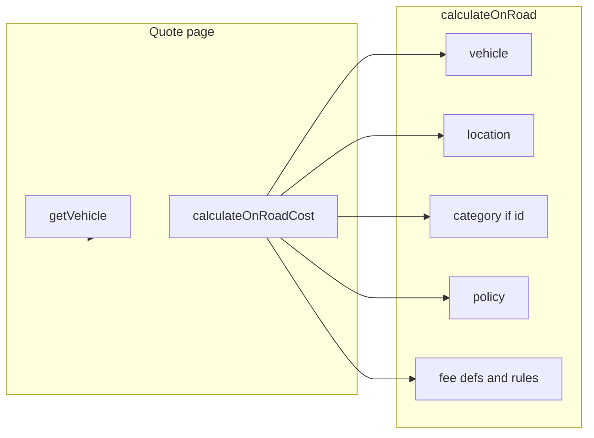

# Web Load Speed - Plan

## Goal Capsule

- **Objective:** Signed-in operators move through brand catalog, vehicle, and on-road quote without stacked waits: no login flash on reload, no serial quote fetches, and no extra Neon round-trips for independent reads.
- **Product authority:** This contract. Surrounding work (RSC rewrite, Neon driver change, export speed) is out of scope.
- **Open blockers:** None.

## Product Contract

### Summary

Make the operator quote path feel fast by removing waits the operator should not pay: a login screen flash after they already signed in, a quote page that fetches vehicle then cost in series, and cost calculation that looks up independent rows one after another. Repeat visits to stable catalog lists should not wait on the database again in the same session.

### Problem Frame

Every operator page is an empty client shell that loads data after paint. On reload the shell first treats the operator as signed out, so the login screen appears and then the catalog. The quote page waits for vehicle details before it even starts the cost request, and that cost request itself waits on several independent database lookups in sequence. Warm catalog reads already sit near an 80ms floor per round-trip; chaining them is what the operator feels as "the web is slow."

### Key Decisions

- **Keep the current client pages and Neon HTTP access path.** Chosen over rewriting pages to server-render or switching the database driver. Governs R3, R4, R5.
- **Fix stacked waits, not first-byte of a single lookup.** Chosen over a CDN/image/font pass. Governs R1, R2, R3.
- **Cache only stable catalog lists and dealer policy, in the serving process and in the browser.** Chosen over a new client data library. Governs R5.

### Actors

- A1. Signed-in operator (salesperson building an on-road quote).

### Requirements

**Session start**

- R1. When an operator already has a valid session and reloads or opens any app URL, the first paint is the app, not the login screen.
- R2. Login still appears when there is no session, and sign-out still returns to login.

**Quote path**

- R3. Opening the on-road quote page starts vehicle load and cost calculation together. The operator waits for the slower of the two, not the sum.
- R4. Cost calculation looks up vehicle, location, category, fee lists, and policy independently and at the same time when those reads do not depend on each other.

**Catalog repeats**

- R5. Brands, categories, locations, and dealer policy do not hit the database again for a repeat GET in the same serving process, and the browser may reuse a fresh prior GET.

**Honesty of loading**

- R6. First visit to a catalog or vehicle page may show a loading state until data arrives. It must not add extra serial waits on top of that.

### Key Flows

- F1. Reload while signed in.
  **Trigger:** A1 refreshes the catalog, vehicle, or quote URL.
  **Covers R1, R2.**
  The login screen does not appear. The page shell is the signed-in app.

- F2. Open on-road quote.
  **Trigger:** A1 submits the vehicle form and lands on the quote URL.
  **Covers R3, R4, R6.**
  Vehicle details and cost breakdown start together. The quote sheet appears when both are ready.

- F3. Browse catalog then vehicle then back.
  **Trigger:** A1 opens a brand, a vehicle, then returns.
  **Covers R5, R6.**
  The first catalog load may wait. Back-navigation reuses brands, categories, locations, and policy.

### Acceptance Examples

- AE1. A1 is signed in, hard-reloads `/brand/MITSUBISHI`. **Covers R1.** Login never appears; catalog shell is first.
- AE2. A1 is signed out and opens `/`. **Covers R2.** Login is first.
- AE3. A1 opens a quote URL with vehicle and location already in the query. **Covers R3.** Vehicle request and cost request overlap in time.
- AE4. Warm cost calculation for the same vehicle and location. **Covers R4.** Independent row lookups are not started only after the previous one finishes.
- AE5. A1 opens the vehicle form, then returns to catalog, then opens another vehicle. **Covers R5.** Categories, locations, and policy are not fetched from the database a second time in that serving process.

### Success Criteria

- Signed-in reload does not flash login (AE1).
- Quote-page wait is one overlap, not vehicle-then-cost (AE3).
- Warm on-road calculation is no longer a chain of independent lookups (AE4). Local measurement before this work: sequential quote ~324ms warm / ~1069ms cold; calculate-only ~230ms warm; single catalog GET ~80ms warm.
- Repeat catalog list GETs in the same process skip the database (AE5).

### Scope Boundaries

- In: operator catalog, vehicle form, on-road quote, session gate.
- Out: PDF/Excel export duration, translating copy, admin CRUD, image CDN / `next/image`, new client cache library, converting pages to server components, changing the Neon HTTP driver, adding loading.tsx route files unless a page already has a loading hole this work creates.

### Dependencies / Assumptions

- Neon stays the database. Catalog lists are small and safe to cache briefly.
- First-visit Neon latency of a single lookup is acceptable; stacked lookups are not.
- Dev compile time on first navigation is not in scope for production behavior.

### Outstanding Questions

- None blocking. Planning resolved cache lifetime (KTD4) and duplicate vehicle read (KTD3).

### Sources / Research

- Live timings on 2026-08-20 against local Next.js 16 + Neon `ap-southeast-1`: HTML shells 33–53ms warm; catalog GETs 76–86ms warm; dealer policy 294ms then 6ms (process cache); quote sequential 801+268ms cold / 91+233ms warm; calculate-only 231–236ms; vehicle-page four-parallel wall 103–130ms.
- Prior server log: first `/api/vehicles/13` 1200ms; `POST /api/calculate-on-road-cost` 625–785ms; first on-road HTML 1705ms (dev compile).
- Grounding: `/tmp/compound-engineering-0/ce-brainstorm/web-perf-20260820/grounding.md`
- `web/src/server/db/client.ts` uses Neon HTTP.
- `web/src/views/OnRoadQuotePage.tsx` loads vehicle then cost.
- `web/src/server/services/catalog-service.ts` `calculateOnRoad` looks up vehicle, then location, then category, then parallel policy/fee reads.
- `web/src/auth/AdminAuthContext.tsx` starts signed-out until an effect reads storage.
- `web/src/views/VehiclePage.tsx` already loads vehicle, categories, locations, and policy together.
- No `Cache-Control`, `revalidate`, React Query, or SWR in `web/`.

---

## Planning Contract

**Product Contract preservation:** Product Contract unchanged. Outstanding questions closed as KTD3 and KTD4.

### Key Technical Decisions

- KTD1. **Session gate uses a ready flag, not a signed-out default.** `AdminAuthProvider` must not start as signed-out. Until storage is read, `AppShell` Gate renders nothing (or the app shell without login). After ready: token present → app (R1); no token → login (R2). Do not initialize `useState(isAdminSignedIn())` as the sole fix: the server render sees no `localStorage` and would still mismatch. Governs R1, R2.
- KTD2. **Quote page mirrors VehiclePage `Promise.all`.** Start `getVehicle` and `calculateOnRoadCost` in the same tick. If `sessionStorage` already has extras for that vehicle, send them on the cost POST. If not, omit extras so domain code uses vehicle defaults (`on-road-cost.ts` deposit fallback). After both settle, `loadExtras(id, extrasFromVehicle(vehicle))` for the editor. Governs R3. Duplicate vehicle read inside calculate stays; wall-clock is still the max, not the sum.
- KTD3. **One `Promise.all` inside `calculateOnRoad` for independent rows.** Always include vehicle, location, policy snapshot, fee definitions, and fee rules. Include `findCategoryById` in that batch only when `categoryId` is set. When it is omitted, use the category already joined on the vehicle row. Do not start location only after vehicle. Governs R4.
- KTD4. **Process cache until admin write; browser `max-age=60`.** Cache mapped brands, categories, and locations in `catalog-service` the way `policy-store` caches policy. Invalidate on catalog admin save/delete/import. Dealer policy already has a process cache. Public GET routes for those four resources set `Cache-Control: public, max-age=60`. Do not cache vehicle, search, or calculate. Governs R5.

### Assumptions

- In-process cache is per warm isolate on Vercel, same as today's policy cache. Browser `max-age` covers repeat GETs across isolates within 60 seconds.
- Admin edits may take up to 60 seconds to appear in another browser. Operators who save catalog data then immediately quote in the same process see fresh data because of invalidation.
- No React Testing Library in `web/`. View changes are verified by unit helpers plus `npm test` and a local smoke of the quote path.

### High-Level Technical Design

Independent arrows start together. Category without an id is taken from the vehicle row after that promise settles.

---

## Implementation Units

### U1. Stop login flash on reload

**Goal:** Signed-in reload paints the app, not login.
**Requirements:** R1, R2, F1, AE1, AE2. KTD1.
**Dependencies:** None.
**Files:** `web/src/auth/AdminAuthContext.tsx`, `web/src/components/AppShell.tsx`, `web/src/auth/sessionGate.ts`, `web/src/auth/sessionGate.test.ts`
**Approach:**
1. Add `sessionGateView(ready, signedIn)` returning `pending` | `login` | `app`.
2. Provider tracks `ready` and `signedIn`. First client effect reads `isAdminSignedIn()` then sets both.
3. Gate: pending → null; login → `LoginScreen`; app → children.
**Patterns to follow:** `web/src/lib/adminAuth.ts` window guard; keep `ADMIN_AUTH_EVENT` listeners.
**Test scenarios:**
- Covers AE1. `ready=true`, `signedIn=true` → `app`.
- Covers AE2. `ready=true`, `signedIn=false` → `login`.
- `ready=false` → `pending` regardless of signedIn (no login flash).
**Verification:** `npm test` from `web/` includes the new file. Reload with a token does not show login.

### U2. Start quote vehicle and cost together

**Goal:** Quote page wait is overlap, not sum.
**Requirements:** R3, R6, F2, AE3. KTD2.
**Dependencies:** None.
**Files:** `web/src/views/OnRoadQuotePage.tsx`
**Approach:**
1. Replace sequential `getVehicle.then(calculateOnRoadCost)` with `Promise.all`.
2. Read extras from `sessionStorage` before the cost call; omit extras if none stored.
3. Keep the cancelled flag and one loading state until both settle.
**Patterns to follow:** `web/src/views/VehiclePage.tsx` `Promise.all` load.
**Test scenarios:**
- Covers AE3. Both requests are created before either awaits the other.
- Missing location still errors before fetch, same as today.
**Verification:** Quote URL loads vehicle and cost overlapping. Loading copy remains until both return.

### U3. Parallelize on-road database reads

**Goal:** Independent Neon lookups in `calculateOnRoad` start together.
**Requirements:** R4, AE4. KTD3.
**Dependencies:** None.
**Files:** `web/src/server/services/catalog-service.ts`, `web/src/server/services/catalog-service.test.ts`
**Approach:**
1. `Promise.all` vehicle, location, policy, fee definitions, fee rules, and optional category.
2. If vehicle or location is missing, keep today's not-found results.
3. Test with injected stubs or a small extracted loader so order of completion cannot be serial-by-construction.
**Patterns to follow:** Existing inner `Promise.all` for policy and fees at `catalog-service.ts` `calculateOnRoad`.
**Test scenarios:**
- Covers AE4. Stub finders record start timestamps; location starts before vehicle resolves.
- Missing vehicle still returns null.
- Missing location still returns `{ error: "location" }`.
- `categoryId` set uses that category; omitted uses the vehicle join.
**Verification:** `npm test` from `web/`. Warm calculate is one parallel wave, not vehicle-then-location.

### U4. Cache stable catalog lists

**Goal:** Repeat brands, categories, locations, and dealer policy skip Neon in-process; browsers may reuse for 60 seconds.
**Requirements:** R5, F3, AE5. KTD4.
**Dependencies:** U3 only if cache lives in the same service file; otherwise none.
**Files:** `web/src/server/services/catalog-service.ts`, `web/src/server/services/catalog-service.test.ts`, `web/src/server/services/catalog-admin-service.ts`, `web/src/server/http.ts`, `web/src/app/api/brands/route.ts`, `web/src/app/api/vehicle-categories/route.ts`, `web/src/app/api/locations/route.ts`, `web/src/app/api/dealer-policy/route.ts`
**Approach:**
1. Module-level cache for `getBrands`, `getCategories`, `getLocations` with `invalidateCatalogCache()` and `resetCatalogCacheForTests()`.
2. Call invalidate after catalog admin writes and `importAll` that touch brands, categories, or locations.
3. Extend `json()` to accept optional headers. Those four GET routes send `Cache-Control: public, max-age=60`.
**Patterns to follow:** `web/src/server/config/policy-store.ts` cache and `invalidatePolicyCache()` from `policy-admin-service.ts`.
**Test scenarios:**
- Covers AE5. Second `getCategories()` does not call the list function.
- After `invalidateCatalogCache()`, the next read calls the list function again.
- `json` with cache headers includes `Cache-Control: public, max-age=60`.
**Verification:** `npm test` from `web/`. Second vehicle-page bootstrap does not re-query those lists in the same process.

---

## Verification Contract

- `npm test` from `web/` — session gate, catalog-service parallel load, catalog cache, json cache headers.
- Local smoke: signed-in reload of `/brand/MITSUBISHI` shows no login; open a vehicle then quote and confirm vehicle and calculate overlap in the Next.js log; second visit to vehicle form is faster on categories/locations/policy.
- `npm run build` from `web/` if types change.

---

## Definition of Done

- R1–R6 hold on the operator catalog → vehicle → quote path.
- U1–U4 landed with their tests green.
- No Neon driver change, no RSC rewrite, no new client cache library.
- AGENTS.md updated only if a durable cache/invalidation contract is added under `web/` or `web/src/server/db/`.
